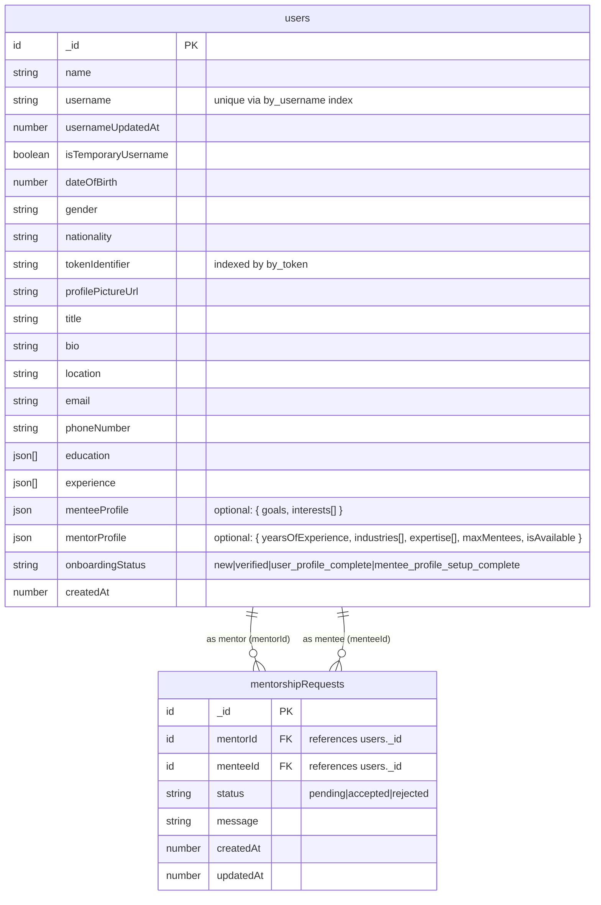
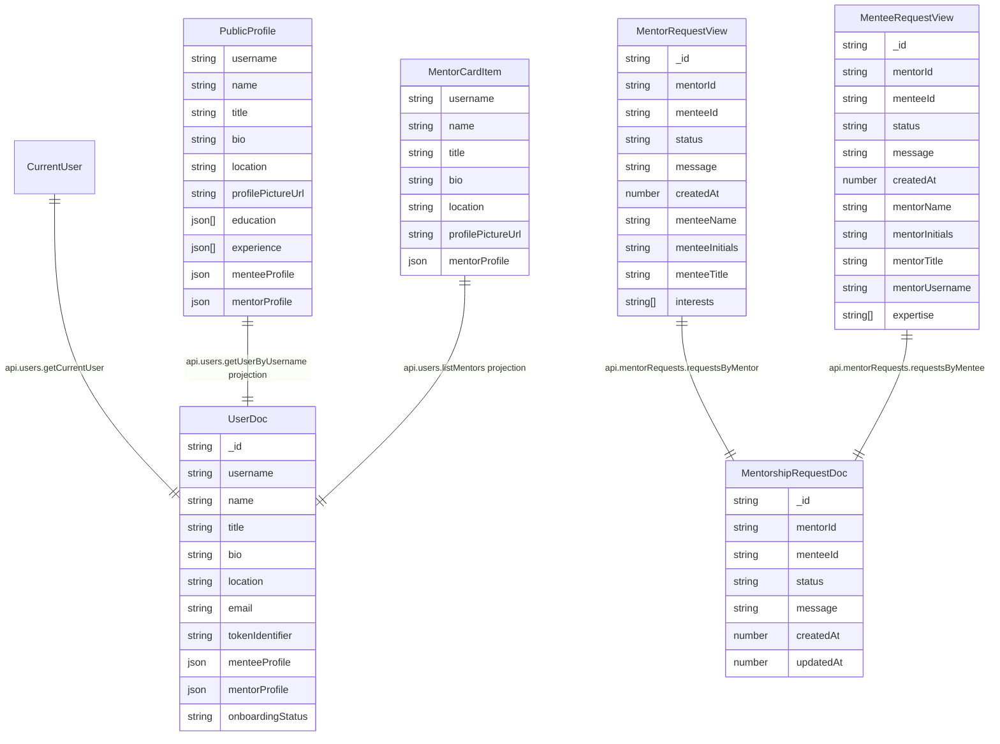

# ACS OBA Mentorship - Current Data Model ERD

This document reflects the **current** data model implemented in the codebase.
It supersedes the ERD in `README.md`, which still describes additional planned tables that are not yet in the active Convex schema.

## Backend ERD (Convex Schema - Source of Truth)

## Backend Indexes

### `users`
- `by_token`: `tokenIdentifier`
- `by_username`: `username`
- `by_mentor_availability`: `mentorProfile.isAvailable`

### `mentorshipRequests`
- `by_mentorId`: `mentorId`
- `by_menteeId`: `menteeId`
- `by_mentorId_status`: `(mentorId, status)`
- `by_menteeId_status`: `(menteeId, status)`
- `by_mentorId_menteeId`: `(mentorId, menteeId)`

## Frontend Data Model (Consumed API Shapes)

The frontend is driven by Convex query/mutation contracts. The key UI entities are projections of backend documents:

## README ERD vs Current State

`README.md` currently describes a broader target design with tables like `Mentors`, `Mentees`, `Mentorships`, `PulseSurveys`, `ExitSurveys`, `IncidentReports`, and `UserInterests`.

The **implemented** schema today uses:
- one consolidated `users` table for identity + role-specific profile data
- one `mentorshipRequests` table for request lifecycle
- no `mentorships` table yet (still marked as TODO in `web/convex/schema.ts`)

Use this file as the up-to-date ERD reference until the planned tables are added to the Convex schema.
