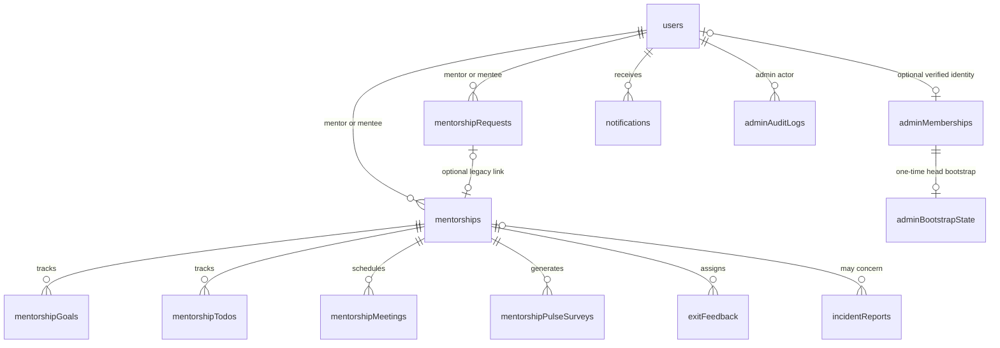

# ACS OBA Shepherds Programme - Current Data Model

This document describes the Convex schema implemented in `web/convex/schema.ts`.
The schema file is the source of truth.

## Relationship overview

## Tables

### `users`

Identity, profile, mentor/mentee settings, and onboarding state.

- Auth linkage: `tokenIdentifier`, `authEmailNormalized`,
  `authEmailVerified`
- Membership gate: `membershipVerificationStatus`,
  `membershipVerifiedEmail`, `membershipVerifiedAt`
- Public profile: `name`, `username`, `title`, `bio`, `location`,
  `profilePictureUrl`
- Private/contact profile: `email`, `phoneNumber`, `dateOfBirth`, `gender`,
  `nationality`
- Background: `careerStage`, `interests`, `industries`, `education`,
  `experience`
- Mentee settings: goals, commitment level, preferred communication modes
- Mentor settings: experience, expertise, capacity, availability, discovery
  visibility, and identity-disclosure settings
- Indexes: auth token, username, contact email, verified auth email, mentor
  availability

The verified authentication email is deliberately separate from the editable
contact email. Administrator access never trusts the contact email.
Completing onboarding also requires a persisted membership result for the
current verified authentication email. When ACSOBA verification is configured
as required, an Auth0-only fallback result is rejected.

### `adminMemberships`

Application-level admin authorization bound to a verified identity.

- Email invitation: `normalizedEmail`, display `email`
- Role: `admin` or `head_admin`
- Lifecycle: `invited`, `active`, `revoked`
- Stable identity binding: optional `userId`
- Provenance: inviter, invitation/activation/revocation/update timestamps
- Indexes: normalized email, user ID, status, status + role

Ordinary admins share the same operational permissions. The head admin has two
additional capabilities: manage ordinary administrator memberships and view
the administrator audit log.

### `adminBootstrapState`

One singleton record, `head_admin_v1`, created when the verified
`HEAD_ADMIN_EMAIL` identity first signs in. It prevents an environment-variable
change from silently creating a second head administrator.

### `adminAuditLogs`

Append-only records for successful administrator membership, programme
settings, and incident workflow changes.

### `programSettings`

Singleton operational configuration:

- Maximum active or pending mentors per mentee
- Mentorship request expiry days
- Pulse survey interval days
- Exit feedback due days

Code defaults are used until an administrator saves a settings record.

### `mentorshipRequests`

Mentee-to-mentor request lifecycle: `pending`, `accepted`, `rejected`, or
`expired`. Newly created requests store their proposed mentorship length and
their own expiry timestamp so later settings changes do not rewrite existing
deadlines. Both fields remain optional in the schema for legacy records; legacy
logic uses documented three-month and seven-day defaults where needed.

### `mentorships`

Tracked mentor/mentee relationship created idempotently from an accepted
request. New accepted-request relationships record the request ID, agreed
duration, and planned end date; status is `active`, `completed`, or
`cancelled`. Those request-derived fields remain optional for legacy records.
Exit initiation is recorded independently so the mentorship remains accessible
until both exit forms are submitted.

### `mentorshipGoals` and `mentorshipTodos`

Shared goals, milestones, assignments, due dates, and completion state for an
active relationship.

### `mentorshipMeetings`

Scheduled mentoring sessions with start/end times, location or meeting URL,
notes, and `scheduled`, `cancelled`, or `completed` status.

### `mentorshipPulseSurveys`

Periodic, independent mentor and mentee relationship-health assignments.
Responses contain three 1-5 ratings, an admin-support flag, optional comments,
and submission timestamps. Responses are not shown to the counterpart but are
visible to authorized programme administrators.

### `exitFeedback`

Two independent exit assignments per mentorship, one for each participant.
Tracks due/submission state, reason, rating, goals outcome, recommendation,
highlights, improvements, and optional comments. The mentorship completes after
both assignments are submitted.

### `incidentReports`

Confidential participant reports with required `reporterId`, optional
`reportedUserId` and `mentorshipId`, category, severity, narrative, optional
occurrence date, contact consent, admin assignment/notes, and `open`,
`in_review`, `resolved`, or `dismissed` status. General reports can be unlinked
from a mentorship or person. Reports are not anonymous to authorized admins:
admins see the reporter's name, while `allowContact=false` suppresses the
reporter's contact email.

### `notifications`

Persistent in-app notifications for request receipt/outcomes/expiry, due pulse
and exit forms, and incident status updates.

## Authorization boundaries

- Participant queries and mutations derive the actor from Convex/Auth0
  authentication and enforce relationship ownership.
- Operational admin functions resolve an active `adminMemberships` row by the
  caller's linked user ID on every request.
- Admin membership mutations require the active head-admin membership.
- The frontend route guard prevents content flashes, but Convex function guards
  are the authoritative security boundary.
- Mentor identity redaction happens in server-returned DTOs; discovery defaults
  to an unnamed mentor until disclosure is enabled.
