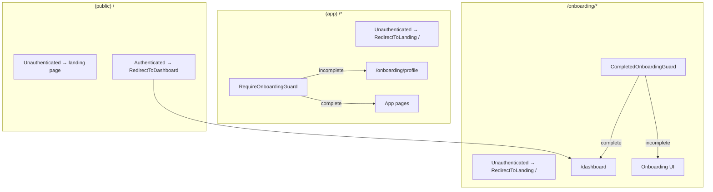

# Onboarding routing

How the app decides where authenticated users go, based on `users.onboardingStatus` in Convex.

## Status and paths

Defined in `src/lib/onboarding.ts`:

| Constant | Value | Meaning |
|----------|-------|---------|
| `ONBOARDING_STATUS.INCOMPLETE` | `"incomplete"` | User has logged in but not finished onboarding |
| `ONBOARDING_STATUS.COMPLETE` | `"complete"` | Onboarding finished; full app access |
| `ONBOARDING_START_PATH` | `/onboarding/profile` | First onboarding step |
| `POST_ONBOARDING_PATH` | `/dashboard` | Default home after onboarding |

Auth0 returns to `window.location.origin` (typically `/`) after login (`ConvexClientProvider.tsx`).

## Data layer

### User record lifecycle

1. **First login** — `SyncUser` calls `storeUser` once per session (`sessionStorage` key `convex_user_synced`). Creates a user with `onboardingStatus: "incomplete"` and a temporary username.
2. **While onboarding** — Client reads the user via `getCurrentUser` (no onboarding check on this query).
3. **Finish onboarding** — Wizard calls `setUserOnboardingComplete`, which patches profile fields, sets `menteeProfile`, and sets `onboardingStatus: "complete"`.
4. **Sensitive APIs** — Most other Convex functions use `requireOnboardingComplete()` in `convex/model/auth.ts` and throw if status is not `"complete"`.

### Client user context

`CurrentUserProvider` (`src/app/CurrentUserProvider.tsx`) wraps the app and exposes:

- `currentUser` — result of `useQuery(api.users.getCurrentUser)` when authenticated, otherwise skipped
- `isAuthenticated` / `isLoading` — from `useConvexAuth()`

Guards read this context; they do not run separate queries.

## Route groups and guards

Routing uses **layout-level guards** and **Convex `<Authenticated>` / `<Unauthenticated>`** splits—not a shared onboarding-gate hook.

### `(public)/` — landing (`/`)

**File:** `src/app/(public)/layout.tsx`

| Auth | Behavior |
|------|----------|
| Unauthenticated | Renders marketing home (`SiteNav`, page, `SiteFooter`) |
| Authenticated | `RedirectToDashboard` → `/dashboard` |

Authenticated users never stay on `/`; they are sent to the app shell first. Incomplete users are then handled by `RequireOnboardingGuard` on `(app)` routes.

### `(app)/` — mentee app (`/dashboard`, `/search`, `/profile`, `/requests`, …)

**File:** `src/app/(app)/layout.tsx`

| Auth | Behavior |
|------|----------|
| Unauthenticated | `RedirectToLanding` → `/` |
| Authenticated | Wrapped in `RequireOnboardingGuard` |

**`RequireOnboardingGuard`** (`src/components/navigation/onboarding-guard.tsx`):

- While `isLoading` or `currentUser` is `undefined` / `null` → renders **nothing** (`null`)
- If `onboardingStatus !== "complete"` → `redirect(ONBOARDING_START_PATH)`
- Otherwise → renders children (nav + page)

### `/onboarding/*` — onboarding wizard

**Files:** `src/app/onboarding/layout.tsx`, `src/app/onboarding/page.tsx`

| Auth | Behavior |
|------|----------|
| Unauthenticated | `RedirectToLanding` → `/` |
| Authenticated | Wrapped in `CompletedOnboardingGuard` |

`/onboarding` (index) server-redirects to `/onboarding/profile`.

**`CompletedOnboardingGuard`** (`src/components/navigation/completed-onboarding-guard.tsx`):

- While loading / no user → **nothing** (`null`)
- If `onboardingStatus === "complete"` → `redirect(POST_ONBOARDING_PATH)` (`/dashboard`)
- Otherwise → renders onboarding children

### `(mentor)/` — mentor area (`/mentor/*`)

**File:** `src/app/(mentor)/layout.tsx`

| Auth | Behavior |
|------|----------|
| `AuthLoading` | `MentorLoadingSkeleton` |
| Unauthenticated | `RedirectToLanding` → `/` |
| Authenticated | `ProtectedMentorShell` only |

There is **no** `RequireOnboardingGuard` on mentor routes. `ProtectedMentorShell` only checks for `mentorProfile` and redirects to `/dashboard` if missing. Onboarding enforcement for mentors is backend-only unless they hit `(app)` routes.

### Role-specific shells (nested)

| Shell | Layout | Check |
|-------|--------|-------|
| `ProtectedMenteeShell` | `(app)/requests/layout.tsx` | `menteeProfile` required; else → `/dashboard` |
| `ProtectedMentorShell` | `(mentor)/layout.tsx` | `mentorProfile` required; else → `/dashboard` |

Parent `(app)` layout already requires completed onboarding before these run.

## Redirect helpers

**File:** `src/components/auth/redirects.tsx`

| Export | Target |
|--------|--------|
| `RedirectToLanding` | `/` |
| `RedirectToDashboard` | `/dashboard` |

Used inside Convex auth boundary components; each calls Next.js `redirect()` during render.

## Typical flows

### New user after Auth0 login

1. Redirect to `/`
2. `(public)` → authenticated → `/dashboard`
3. `(app)` `RequireOnboardingGuard` → incomplete → `/onboarding/profile`
4. User completes wizard → `setUserOnboardingComplete`
5. Later navigations pass the guard and show the app

### Onboarded user opens `/` in a new tab

1. `(public)` authenticated → `/dashboard`
2. Guard sees `complete` → app renders

No onboarding loading screen on `/`; public layout does not inspect onboarding status.

### Incomplete user bookmarks `/dashboard` or `/profile`

1. `(app)` guard → `/onboarding/profile`

### Complete user visits `/onboarding/*`

1. `CompletedOnboardingGuard` → `/dashboard`

## Loading behavior

Guards return `null` until both Convex auth and `getCurrentUser` have settled.

## File map

| File | Role |
|------|------|
| `src/lib/onboarding.ts` | Path and status constants |
| `src/app/CurrentUserProvider.tsx` | Single `getCurrentUser` subscription |
| `src/components/auth/SyncUser.tsx` | First-login `storeUser` |
| `src/components/navigation/onboarding-guard.tsx` | Block incomplete users from `(app)` |
| `src/components/navigation/completed-onboarding-guard.tsx` | Block complete users from `/onboarding` |
| `src/components/auth/redirects.tsx` | `/` and `/dashboard` redirect components |
| `src/app/(public)/layout.tsx` | Landing vs dashboard for authed users |
| `src/app/(app)/layout.tsx` | App shell + onboarding guard |
| `src/app/onboarding/layout.tsx` | Onboarding shell + completed guard |
| `convex/model/auth.ts` | `requireOnboardingComplete` for API enforcement |
| `convex/model/users.ts` | `storeUser`, `getCurrentUser`, `setUserOnboardingComplete` |

## Legacy files

`src/components/auth/onboarding-gate.tsx`, `use-onboarding-redirect.ts`, and `onboarding-loading-screen.tsx` may still exist in the repo but are **not wired** into current layouts. Routing is handled by the guards and layouts above.
