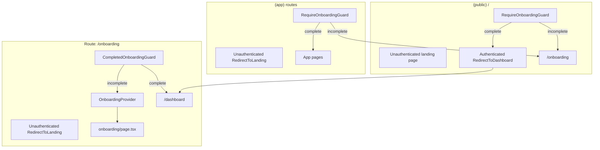
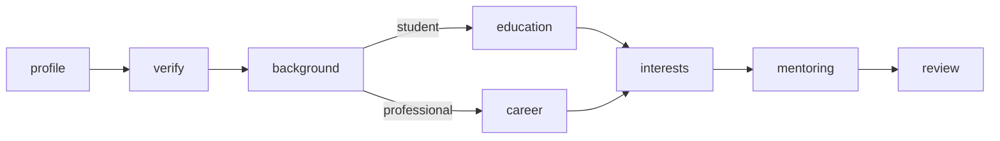

# Onboarding routing

How the app decides where authenticated users go, based on `users.onboardingStatus` in Convex.

## Status and paths

Defined in `src/lib/onboarding.ts`:

| Constant | Value | Meaning |
|----------|-------|---------|
| `ONBOARDING_STATUS.INCOMPLETE` | `"incomplete"` | User has logged in but not finished onboarding |
| `ONBOARDING_STATUS.COMPLETE` | `"complete"` | Onboarding finished; full app access |
| `ONBOARDING_START_PATH` | `/onboarding` | Single onboarding wizard route |
| `POST_ONBOARDING_PATH` | `/dashboard` | Default home after onboarding |

Auth0 returns to `window.location.origin` (typically `/`) after login (`ConvexClientProvider.tsx`).

## Data layer

### User record lifecycle

1. **First login**: `SyncUser` calls `storeUser` once per session (`sessionStorage` key `convex_user_synced`). Creates a user with `onboardingStatus: "incomplete"` and a temporary username.
2. **While onboarding**: Client reads the user via `getCurrentUser` (no onboarding check on this query).
3. **Finish onboarding**: Wizard calls `setUserOnboardingComplete`, which patches profile fields, sets `menteeProfile`, and sets `onboardingStatus: "complete"`.
4. **Sensitive APIs**: Most other Convex functions use `requireOnboardingComplete()` in `convex/model/auth.ts` and throw if status is not `"complete"`.

### Client user context

`CurrentUserProvider` (`src/app/CurrentUserProvider.tsx`) wraps the app and exposes:

- `currentUser`: result of `useQuery(api.users.getCurrentUser)` when authenticated, otherwise skipped
- `isAuthenticated` / `isLoading`: from `useConvexAuth()`

Guards read this context; they do not run separate queries.

## Route groups and guards

Routing uses layout-level guards and Convex `<Authenticated>` / `<Unauthenticated>` splits.

### `(public)/` landing (`/`)

**File:** `src/app/(public)/layout.tsx`

| Auth | Behavior |
|------|----------|
| Unauthenticated | Renders marketing home (`SiteNav`, page, `SiteFooter`) |
| Authenticated, incomplete onboarding | `RequireOnboardingGuard` redirects to `/onboarding` |
| Authenticated, complete onboarding | `RequireOnboardingGuard` allows render, then `RedirectToDashboard` to `/dashboard` |

Authenticated users never stay on `/`. The authenticated branch is wrapped in `RequireOnboardingGuard`, so incomplete users go directly to `/onboarding`; complete users are redirected to `/dashboard`.

### `(app)/` mentee app (`/dashboard`, `/search`, `/profile`, `/requests`, ...)

**File:** `src/app/(app)/layout.tsx`

| Auth | Behavior |
|------|----------|
| Unauthenticated | `RedirectToLanding` to `/` |
| Authenticated | Wrapped in `RequireOnboardingGuard` |

**`RequireOnboardingGuard`** (`src/components/navigation/onboarding-guard.tsx`):

- While `isLoading` or `currentUser` is `undefined` / `null`, renders `null`.
- If `onboardingStatus !== "complete"`, replaces the current route with `ONBOARDING_START_PATH` (`/onboarding`).
- Otherwise, renders children.

### `/onboarding` single-route wizard

**Files:** `src/app/onboarding/layout.tsx`, `src/app/onboarding/page.tsx`

| Auth | Behavior |
|------|----------|
| Unauthenticated | `RedirectToLanding` to `/` |
| Authenticated | Wrapped in `CompletedOnboardingGuard`, then `OnboardingProvider` |

The wizard no longer exposes step URLs like `/onboarding/profile` or `/onboarding/review`. `src/components/onboarding/onboarding-provider.tsx` owns:

- `draft`: unsaved client-only form data
- `step`: active onboarding step
- `goNext` / `goBack`: step navigation
- `resetDraft`: clears draft and returns to the first step

`src/app/onboarding/page.tsx` reads `step` from context and renders the active step component.

Because step state is not in the URL, users cannot jump to arbitrary onboarding chapters by typing a path. Refreshing resets the in-memory draft and returns to the `profile` step.

**`CompletedOnboardingGuard`** (`src/components/navigation/completed-onboarding-guard.tsx`):

- While loading / no user, renders `null`.
- If `onboardingStatus === "complete"`, replaces the current route with `POST_ONBOARDING_PATH` (`/dashboard`).
- Otherwise, renders onboarding children.

### `(mentor)/` mentor area (`/mentor/*`)

**File:** `src/app/(mentor)/layout.tsx`

| Auth | Behavior |
|------|----------|
| Unauthenticated | `RedirectToLanding` to `/` |
| Authenticated with incomplete onboarding | `RequireOnboardingGuard` redirects to `/onboarding` |
| Authenticated with complete onboarding | `RequireOnboardingGuard` allows render, then `ProtectedMentorShell` requires `mentorProfile` or redirects to `/dashboard` |

Mentor routes are wrapped in `RequireOnboardingGuard`, so incomplete users are redirected to `/onboarding` before mentor content renders. After onboarding is complete, `ProtectedMentorShell` checks for `mentorProfile` and redirects to `/dashboard` if it is missing.

### Role-specific shells

| Shell | Layout | Check |
|-------|--------|-------|
| `ProtectedMenteeShell` | `(app)/requests/layout.tsx` | `menteeProfile` required; else `/dashboard` |
| `ProtectedMentorShell` | `(mentor)/layout.tsx` | `mentorProfile` required; else `/dashboard` |

Parent `(app)` layout already requires completed onboarding before these run.

## Redirect helpers

**File:** `src/components/auth/redirects.tsx`

| Export | Target |
|--------|--------|
| `RedirectToLanding` | `/` |
| `RedirectToDashboard` | `/dashboard` |

Used inside Convex auth boundary components.

## Typical flows

### New user after Auth0 login

1. Redirect to `/`.
2. `(public)` authenticated branch: `RequireOnboardingGuard` sees incomplete onboarding and redirects to `/onboarding`.
3. User completes the single-route wizard.
4. Wizard calls `setUserOnboardingComplete`, then sends the user to `/dashboard`.
5. Later navigations pass the guard and show the app.

### Onboarded user opens `/` in a new tab

1. `(public)` authenticated branch: `RequireOnboardingGuard` sees `complete` and allows render.
2. `RedirectToDashboard` sends the user to `/dashboard`.

### Incomplete user bookmarks `/dashboard` or `/profile`

1. `(app)` guard redirects to `/onboarding`.

### Complete user visits `/onboarding`

1. `CompletedOnboardingGuard` redirects to `/dashboard`.

## Loading behavior

Guards return `null` until both Convex auth and `getCurrentUser` have settled.

## File map

| File | Role |
|------|------|
| `src/lib/onboarding.ts` | Onboarding status and redirect constants |
| `src/lib/onboarding/steps.ts` | Step ordering, branch navigation, and progress helpers |
| `src/app/CurrentUserProvider.tsx` | Single `getCurrentUser` subscription |
| `src/components/auth/SyncUser.tsx` | First-login `storeUser` |
| `src/components/navigation/onboarding-guard.tsx` | Block incomplete users from authenticated `(public)`, `(app)`, and `(mentor)` routes |
| `src/components/navigation/completed-onboarding-guard.tsx` | Block complete users from `/onboarding` |
| `src/components/onboarding/onboarding-provider.tsx` | Client-only wizard draft and step state |
| `src/components/onboarding/steps/*` | Individual onboarding form steps |
| `src/app/onboarding/layout.tsx` | Onboarding auth boundaries and provider |
| `src/app/onboarding/page.tsx` | Single wizard page and active step switch |
| `convex/model/auth.ts` | `requireOnboardingComplete` for API enforcement |
| `convex/model/users.ts` | `storeUser`, `getCurrentUser`, `setUserOnboardingComplete` |
